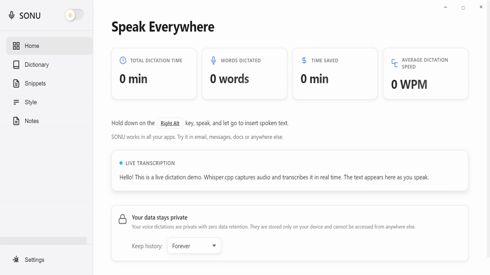

# SONU - Offline Voice Typing Application

<div align="center">


**Professional-grade offline voice typing solution powered by Faster-Whisper AI**

[](#-showcase)
[](#-showcase)
[](https://github.com/ai-dev-2024/sonu)
[](LICENSE)
[](https://www.microsoft.com/windows)
[](https://www.python.org/)
[](https://nodejs.org/)

*Transform your voice into text instantly, completely offline, with enterprise-grade accuracy and AI intelligence.*

---

### 🚀 **New in v3.6.1: Stability & Performance Update**

**SONU now rivals online tools like Wispr Flow and Typeless with powerful offline AI features:**

*   ✨ **Command Mode**: Select text and tell AI to "Fix grammar", "Summarize", or "Make it professional". Powered by local **Phi-3 Mini**.
*   🦎 **Chameleon Mode**: Automatically adapts to your active app (e.g., coding style for VS Code, casual style for Slack).
*   🧠 **100% Offline Intelligence**: Run advanced LLMs entirely on your CPU. No subscriptions, no data leaks.

---

### 🎯 **Professional Sponsorship Needed for Cross-Platform Development**

<div align="center">

**🚀 Help SONU Go Multi-Platform! 🚀**

SONU needs **professional sponsorship** to accelerate development and bring voice typing to **macOS, Linux, Android, and iOS**.

**[👉 Support Cross-Platform Development](https://ko-fi.com/ai_dev_2024)** | **[⭐ Star on GitHub](https://github.com/ai-dev-2024/sonu)**

</div>

**Development Journey:** SONU was built entirely using **free trials and free API usage**, demonstrating what's possible with accessible AI development tools. However, to deliver **professional-grade, multi-platform software** at scale, we need sustainable development resources.

**What Sponsorship Enables:**
- 🍎 **macOS Support** - Native DMG installers
- 🐧 **Linux Support** - AppImage, .deb, .rpm packages  
- 📱 **Mobile Apps** - Native Android & iOS
- ⚡ **Continuous Development** - Faster features, better quality
- 🏢 **Enterprise Features** - Code signing, auto-updates, professional support

**Your support directly enables cross-platform portability and professional-grade features!** 🙏

---

</div>

<div align="center">

<!-- Banner GIF/PNG preview -->


<br/>
<sub>Quickstart showcase generation: <code>npm run showcase</code> · Banner: <code>npm run banner</code></sub>

</div>

---

## 📸 Showcase

<div align="center">

### Application Overview

<table>
  <tr>
    <td align="center"><strong>Home Dashboard</strong></td>
    <td align="center"><strong>Dictionary Workspace</strong></td>
    <td align="center"><strong>Snippets Library</strong></td>
  </tr>
  <tr>
    <td></td>
    <td></td>
    <td></td>
  </tr>
  <tr>
    <td align="center"><strong>Style Presets</strong></td>
    <td align="center"><strong>Notes Dashboard</strong></td>
    <td align="center"><strong>Settings - General</strong></td>
  </tr>
  <tr>
    <td></td>
    <td></td>
    <td></td>
  </tr>
  <tr>
    <td align="center"><strong>Settings - System</strong></td>
    <td align="center"><strong>Settings - Model Selector</strong></td>
    <td align="center"><strong>Settings - Themes</strong></td>
  </tr>
  <tr>
    <td></td>
    <td></td>
    <td></td>
  </tr>
  <tr>
    <td colspan="3" align="center"><strong>Dark Theme</strong></td>
  </tr>
  <tr>
    <td colspan="3"></td>
  </tr>
</table>

### Video Showcase

<table>
  <tr>
    <td colspan="3" align="center">
      <h3>🎬 Video Demonstrations</h3>
      <p>
        <a href="https://github.com/ai-dev-2024/sonu/blob/desktop-v3/apps/desktop/assets/showcase/showcase.mp4">📹 MP4 Montage</a> ·
        <a href="https://github.com/ai-dev-2024/sonu/blob/desktop-v3/apps/desktop/assets/showcase/showcase_vp9.webm">📹 VP9 Montage</a> ·
        <a href="https://github.com/ai-dev-2024/sonu/blob/desktop-v3/apps/desktop/assets/showcase/showcase_h265.mp4">📹 HEVC Montage</a>
      </p>
      <p>
        <strong>Slideshows:</strong><br>
        <a href="https://github.com/ai-dev-2024/sonu/blob/desktop-v3/apps/desktop/assets/showcase/showcase_slideshow_h265.mp4">HEVC Slideshow</a> ·
        <a href="https://github.com/ai-dev-2024/sonu/blob/desktop-v3/apps/desktop/assets/showcase/showcase_slideshow_vp9.webm">VP9 Slideshow</a> ·
        <a href="https://github.com/ai-dev-2024/sonu/blob/desktop-v3/apps/desktop/assets/showcase/showcase_slideshow_3s_h265.mp4">HEVC (Ken Burns)</a> ·
        <a href="https://github.com/ai-dev-2024/sonu/blob/desktop-v3/apps/desktop/assets/showcase/showcase_slideshow_3s_vp9.webm">VP9 (Ken Burns)</a>
      </p>
    </td>
  </tr>
</table>

<sub>✨ Screenshots and videos are auto-generated via <code>npm run showcase</code> and saved to <code>apps/desktop/assets/showcase/</code></sub>

</div>
---

## 🚀 Overview

**SONU** is a cutting-edge desktop application that provides real-time voice-to-text transcription using OpenAI's Whisper model via the faster-whisper library, running entirely offline on your Windows machine. Built with Electron and Python entirely using free trials and free API usage (Cursor Free/Pro, KiloCode, VS Code, Cline, and RooCode), SONU offers a seamless, privacy-focused dictation experience that works across all your applications.

### Key Highlights

- ✅ **100% Offline** - No internet connection required, complete privacy
- ✅ **Real-time Transcription** - Live partial results during dictation
- ✅ **Dual Interaction Modes** - Press-and-hold or toggle on/off
- ✅ **System-wide Integration** - Works in any application
- ✅ **Professional UI** - Modern, glassmorphic design with light/dark themes
- ✅ **Enterprise Ready** - Commercial-grade architecture and documentation
- ✅ **Faster-Whisper Powered** - CPU-optimized transcription engine

---

## 📥 Download & Install

### Windows (Current Platform)

**🚀 Easy Installation - One-Click Installer:**

1. **Download the latest release** from [GitHub Releases](https://github.com/ai-dev-2024/sonu/releases)
2. **Run the installer** (`Sonu Voice Typing Setup.exe`)
3. **Follow the installation wizard** - choose your installation directory
4. **Launch SONU** from Start Menu or Desktop shortcut
5. **Start dictating!** - Configure your hotkeys in Settings

**System Requirements:**
- Windows 10/11 (64-bit)
- 4GB RAM minimum (8GB recommended)
- 2GB free disk space
- Microphone input device

**Note:** Python and Node.js are bundled with the installer - no manual installation required!

### Building from Source

For developers who want to build from source:

```bash
# Clone repository
git clone https://github.com/ai-dev-2024/sonu.git
cd sonu/apps/desktop

# Install dependencies
npm install
pip install -r requirements.txt

# Run in development
npm start

# Build installer
npm run build
```

---

## 🗺️ Multi-Platform Roadmap

SONU is currently available for **Windows** with active development. We're working to bring SONU to more platforms:

### ✅ Available Now
- **Windows 10/11** - Full support with NSIS installer

### 🚧 Coming Soon
- **macOS** - DMG installer (in development)
- **Linux** - AppImage and .deb packages (planned)

### 📱 Mobile Apps
- **Android** - Available separately at [VoiceAI](https://github.com/ai-dev-2024/VoiceAI) (Wispr Flow alternative with Parakeet model)
- **iOS** - Native mobile app (planned)

**Want to help?** We welcome contributions for platform-specific builds! See [CONTRIBUTING.md](CONTRIBUTING.md) for details.

---

## 💎 Professional Sponsorship for Cross-Platform Development

<div align="center">

### 🚀 **Help Us Build the Future of Voice Typing**

**SONU needs professional sponsorship to accelerate cross-platform development and deliver enterprise-grade features.**

</div>

### Why Sponsorship Matters

SONU was built using free trials and free API usage, demonstrating what's possible with accessible AI development tools. However, to deliver **professional-grade, multi-platform software** at scale, we need sustainable development resources.

### What Your Sponsorship Enables

#### 🎯 **Cross-Platform Portability**
- **macOS Development**: Native DMG installers, macOS-specific optimizations
- **Linux Support**: AppImage, .deb, and .rpm packages for all major distributions
- **Mobile Apps**: Native Android and iOS applications
- **Platform Testing**: Comprehensive testing across all platforms

#### ⚡ **Continuous Development**
- **Faster Feature Development**: Rapid iteration and feature delivery
- **Professional Tools**: Access to premium development environments (Cursor Ultra, etc.)
- **Quality Assurance**: Automated testing, CI/CD pipelines, and quality control
- **Bug Fixes**: Rapid response to issues and security updates

#### 🏢 **Enterprise Features**
- **Code Signing**: Digitally signed installers for all platforms
- **Auto-Updates**: Seamless update mechanism across platforms
- **Professional Support**: Dedicated support channels
- **Documentation**: Comprehensive guides and API documentation

### How to Support

**Individual Sponsors:**
- ⭐ **Star the repository** - Show your support
- 💰 **One-time donations** - [Ko-fi](https://ko-fi.com/ai_dev_2024)
- 🔄 **Recurring sponsorship** - GitHub Sponsors (coming soon)

**Professional/Corporate Sponsors:**
- 🏢 **Enterprise Sponsorship** - Direct partnership opportunities
- 🛠️ **Tool Sponsorship** - Development tool licenses (Cursor Ultra, etc.)
- 📦 **Infrastructure Sponsorship** - Build servers, CI/CD resources
- 🎯 **Feature Sponsorship** - Sponsor specific platform ports or features

### Current Sponsors

*Be the first to sponsor SONU's cross-platform journey!*

<div align="center">

**[👉 Support SONU Development](https://ko-fi.com/ai_dev_2024)** | **[⭐ Star on GitHub](https://github.com/ai-dev-2024/sonu)**

*Your support directly enables cross-platform development and professional-grade features*

</div>

---

## ✨ Features

### Core Functionality

- **Press-and-Hold Mode**: Hold a hotkey to dictate, release to finalize and output text
- **Toggle Mode**: Start/stop continuous dictation with a single keypress
- **Command Mode (New)**: Use `Ctrl+Win+E` to modify selected text with AI commands
- **Chameleon Mode (New)**: Auto-detects active app to switch typing profiles
- **Instant Hotkey Response**: Zero-latency hotkey triggering - dictation starts immediately
- **Live Preview**: See partial transcriptions in real-time during dictation
- **Instant System-wide Output**: Text appears instantly at cursor location in any application (like Wispr Flow)
  - Uses modern native addon for fastest typing performance
  - Automatic fallback to clipboard method for reliability
  - Works seamlessly across all Windows applications
- **Clipboard Integration**: Final transcriptions automatically copied to clipboard
- **History Management**: View, edit, and copy previous transcriptions (last 100 items)

### Model Management

- **Multiple Model Sizes**: Choose from tiny, base, small, medium, or large-v3 models
- **Distil-Whisper Models**: Faster alternatives (distil-small.en, distil-medium.en, distil-large-v3)
- **Nvidia Parakeet v3**: State-of-the-art ASR for 25 European languages (requires GPU)
- **Auto-Download**: Automatic model download with progress tracking
- **Model Import**: Import locally downloaded models
- **Smart Recommendations**: System-based model recommendations
- **Cache Management**: Automatic detection of faster-whisper cache locations

### User Interface

- **Modern Design**: Glassmorphic UI inspired by Apple's design language
- **Theme Support**: Beautiful light and dim dark themes with smooth transitions
- **Responsive Layout**: Sidebar navigation with dedicated settings page
- **Live Statistics**: Track total transcriptions, words, and characters
- **Inline Editing**: Edit history items directly in the interface

### Advanced Features

- **Customizable Hotkeys**: Configure hold and toggle shortcuts to your preference
- **Instant Typing Technology**: Multi-tier typing system with automatic fallback
  - Primary: Native addon (`@xitanggg/node-insert-text`) for fastest performance
  - Fallback: Clipboard + Ctrl+V method (what Wispr Flow uses)
  - Final: Clipboard-only if automation unavailable
- **Audio Cues**: Audio feedback for dictation start/stop
- **Tray Integration**: System tray icon with comprehensive context menu
- **Window Controls**: Standard minimize, maximize, and close functionality
- **Version Management**: Built-in versioning system for development

---

## 📋 Requirements

### System Requirements

- **OS**: Windows 10/11 (64-bit)
- **RAM**: Minimum 4GB (8GB recommended)
- **Storage**: 2GB free space (for models)
- **Audio**: Microphone input device

### Software Dependencies

- **Node.js**: v16.0.0 or higher
- **Python**: 3.8 or higher
- **Python Packages**:
  - `faster-whisper` (Whisper model implementation)
  - `pyaudio` (Audio capture)

---

## 🛠️ Development Installation

### Prerequisites

1. **Install Node.js**
   ```bash
   # Download from https://nodejs.org/
   # Verify installation
   node --version
   npm --version
   ```

2. **Install Python**
   ```bash
   # Download from https://www.python.org/
   # Verify installation
   python --version
   pip --version
   ```

3. **Install Python Dependencies**
   ```bash
   pip install faster-whisper pyaudio
   ```

### Application Setup

1. **Clone the Repository**
   ```bash
   git clone https://github.com/ai-dev-2024/sonu.git
   cd sonu
   ```

2. **Navigate to Desktop App**
   ```bash
   cd apps/desktop
   ```

3. **Install Dependencies**
   ```bash
   npm install
   pip install -r requirements.txt
   ```

4. **Run the Application**
   ```bash
   npm start
   ```

### Building for Distribution

```bash
npm run build
```

This creates a Windows installer in the `dist` folder.

**Note:** Building requires Visual Studio Build Tools or running as Administrator due to native dependency compilation.

## 📸 Automated Showcase Capture

Generate fresh screenshots of every major tab without manual clicking:

```bash
npm run showcase
```

The command launches SONU in a special showcase mode, walks through Home, Dictionary, Snippets, Style, Notes, and all Settings sub-pages, and saves PNGs to `assets/showcase/`. To turn the stills into a short MP4 for GitHub or the redbook, run (requires `ffmpeg`):

```bash
ffmpeg -y -framerate 1 -pattern_type glob -i "assets/showcase/*.png" -c:v libx264 -pix_fmt yuv420p assets/showcase/showcase.mp4
```

### Alternative: Playwright Automation

If you prefer Playwright-driven automation (video + screenshots), use:

```bash
npm run auto-screenshots
```

This runs `auto_screenshot.js`, capturing screenshots to `screenshots/` and a walkthrough video to `recordings/`. See `AUTOMATION_README.md` for details.

### Showcase Videos

- HEVC (H.265) slideshow: `assets/showcase/showcase_slideshow_h265.mp4`
- VP9 (WebM) slideshow: `assets/showcase/showcase_slideshow_vp9.webm`
- Original MP4 montage: `assets/showcase/showcase.mp4`
- Social-ready HEVC: `assets/showcase/showcase_h265.mp4`
- Social-ready VP9: `assets/showcase/showcase_vp9.webm`

--- 

## 🎯 Usage

### First Launch

1. Launch SONU from the command line or desktop shortcut
2. The application will start minimized to the system tray
3. Right-click the tray icon to access the main window

### Basic Dictation

#### Press-and-Hold Mode

1. **Configure Hotkey**: Go to Settings → Keyboard Shortcuts → Hold Key
2. **Default**: `Ctrl+Win+Space` (customizable)
3. **Usage**: 
   - Hold the configured hotkey combination
   - Speak your text
   - Release to finalize and output

#### Toggle Mode

1. **Configure Hotkey**: Go to Settings → Keyboard Shortcuts → Toggle Key
2. **Default**: `Ctrl+Shift+Space` (customizable)
3. **Usage**:
   - Press once to start dictation
   - Speak your text (see live partial transcriptions in real-time)
   - Press again to stop and output text instantly
4. **Features**:
   - **Instant Output**: Text appears immediately when toggled off using the last partial transcription
   - **Live Previews**: Real-time partial transcriptions during recording (same as hold mode)
   - **Reliable**: Stable operation even with rapid toggle sequences

### Model Management

1. **Select Model**: Go to Settings → Model Selector
2. **Download Model**: Click "Download and Apply" for your preferred model
3. **Import Model**: Use "Import Model File" to use a locally downloaded model
4. **Auto-Recommendation**: System will recommend the best model based on your hardware

### Advanced Usage

- **View History**: Access previous transcriptions from the Home page
- **Edit Transcripts**: Click any history item to edit before copying
- **Change Themes**: Toggle between light and dark themes via the header switch
- **Customize Settings**: Access comprehensive settings via the sidebar
- **Dictionary Management**: Add custom words to improve transcription accuracy
- **Waveform Animation**: Control the visual waveform indicator during dictation
  - Go to Settings → Vibe Coding → "Show Live Waveform Animation"
  - When **ON**: The floating widget with animated waveform bars appears during dictation
  - When **OFF**: Dictation works normally but the widget is completely hidden
  - The setting applies immediately - toggle it on/off while dictating to see the change

---

## ⚙️ Configuration

### Hotkey Configuration

Hotkeys are configured in the Settings UI (no config.json needed).

### Settings Configuration

Settings are stored in `apps/desktop/data/settings.json`:

```json
{
  "theme": "dark",
  "selected_model": "base",
  "dictation_hotkey": "Ctrl+Space",
  "sound_feedback": true,
  "waveform_animation": true,
  "model_download_path": ""
}
```

### Dictionary Management

Add custom words in the Dictionary tab of the app. Words are stored in `apps/desktop/data/dictionary.json`.

---

## 🏗️ Architecture

### Technology Stack

- **Frontend**: Electron (Chromium + Node.js)
- **Backend**: Python 3.x
- **AI Model**: Faster-Whisper (OpenAI Whisper implementation)
- **UI Framework**: Vanilla HTML/CSS/JavaScript
- **System Integration**: robotjs (system-wide typing)

### Project Structure

```
sonu/
├── apps/
│   ├── desktop/          # Desktop app (v3.x) - ACTIVE
│   │   ├── main.js       # Electron main process
│   │   ├── index.html    # Main UI
│   │   ├── renderer.js   # Renderer process
│   │   ├── package.json  # Desktop dependencies
│   │   └── ...
│   └── mobile/           # Mobile app (v4+) - Future
├── versions/             # Historical versions
│   ├── v3.legacy/        # Archived root files
│   └── ...
├── assets/               # Application assets
├── docs/                 # Documentation
├── scripts/              # Utility scripts
├── tests/                # Test configurations
└── [config files]        # Project-wide configs
```

### Key Components

1. **Main Process** (`main.js`): Window management, hotkey registration, IPC handling, model management
2. **Renderer Process** (`renderer.js`): UI state management, user interactions
3. **Whisper Service** (`whisper_service.py`): Audio capture and transcription using faster-whisper
4. **Preload Script** (`preload.js`): Secure IPC communication bridge
5. **Model Manager** (`model_manager.py`): Model download and cache management

### Faster-Whisper Integration

SONU uses **faster-whisper** (not whisper.cpp) for transcription:

- **Model Names**: Uses faster-whisper standard names (tiny, base, small, medium, large-v3)
- **Cache Location**: 
  - Windows: `%LOCALAPPDATA%\.cache\huggingface\hub\models--openai--whisper-{model}\`
  - Linux/Mac: `~/.cache/huggingface/hub/models--openai--whisper-{model}/`
- **Download**: Automatically downloads from Hugging Face Systran repositories
- **CPU Optimized**: Uses CTranslate2 for efficient CPU-based transcription

---

## 🔒 Privacy & Security

- **GPU Acceleration**: Nvidia GPU support for faster transcription (Parakeet v3)
- **100% Offline**: All processing happens locally on your machine
- **No Data Transmission**: Audio never leaves your device
- **No Telemetry**: Zero tracking or analytics
- **Open Source**: Full source code transparency
- **Local Storage**: All data stored locally in JSON files
- **No Cloud Sync**: All data remains on your device

---

## 🐛 Troubleshooting

### Common Issues

**Issue**: Hotkeys not working
- **Solution**: Ensure no other application is using the same hotkey combination
- **Solution**: Check Windows permissions for global hotkey registration

**Issue**: Audio not being captured
- **Solution**: Verify microphone permissions in Windows Settings
- **Solution**: Check if microphone is set as default input device

**Issue**: Transcription not appearing
- **Solution**: Ensure Python dependencies are installed correctly
- **Solution**: Check console for error messages
- **Solution**: Verify faster-whisper is installed: `pip install faster-whisper`

**Issue**: System-wide typing not working
- **Solution**: Verify `robotjs` is installed: `npm install robotjs`
- **Solution**: Use clipboard fallback (`Ctrl+V`) if robotjs unavailable

**Issue**: Model download fails
- **Solution**: Check internet connection (required only for initial download)
- **Solution**: Verify faster-whisper is installed correctly
- **Solution**: Check disk space availability

### Performance Optimization

- **First Run**: Initial model loading may take 30-60 seconds
- **Memory Usage**: Whisper model requires ~2GB RAM (varies by model size)
- **CPU Usage**: Transcription is CPU-intensive; expect 20-40% usage
- **Model Selection**: Use smaller models (tiny, base) for faster transcription

---

## 📝 Development

### Version History

See [CHANGELOG.md](CHANGELOG.md) for detailed version history.

### Contributing

We welcome contributions! Please see [CONTRIBUTING.md](CONTRIBUTING.md) for guidelines.

1. Fork the repository
2. Create a feature branch from `main`
3. Make your changes
4. Test thoroughly
5. Submit a pull request

### Building from Source

```bash
# Navigate to desktop app
cd apps/desktop

# Install dependencies
npm install
pip install -r requirements.txt

# Run in development mode
npm start

# Build for production
npm run build
```

### Running Tests

#### Automated Testing (Recommended)

Run all tests, generate showcases, and upload to GitHub automatically:

```bash
cd apps/desktop
npm run test:auto
```

This command:
- ✅ Runs unit, integration, and E2E tests
- ✅ Tests all features: Dictionary, Snippets, Notes, Theme, Experimental toggles
- ✅ Generates showcase screenshots
- ✅ Uploads to GitHub automatically

#### Manual Testing

Run tests from the dedicated `tests` workspace:

```bash
cd apps/desktop/tests
npm install

# Unit / Integration / E2E
npm run test:unit
npm run test:integration
npm run test:e2e

# Complete functionality tests (all features)
npm run test:e2e:complete

# Real-time comprehensive tests (clicks all buttons, tests downloads, toggles, copy functions)
npm run test:realtime
```

Alternatively, from the project root using Jest directly:

```bash
npx jest tests/unit --runInBand
npx jest tests/integration --runInBand
npx jest tests/e2e --runInBand
```

#### Test Coverage

The comprehensive test suite covers:
- ✅ Dictionary CRUD operations (add, delete words)
- ✅ Snippets CRUD operations
- ✅ Notes CRUD operations
- ✅ Theme switching and persistence
- ✅ All experimental feature toggles (continuous dictation, low-latency, noise reduction)
- ✅ General settings toggles (sound feedback, waveform animation)
- ✅ Model management and downloading
- ✅ Navigation and UI responsiveness
- ✅ Settings persistence across app restarts

Notes:
- Integration `model_download` tests require network access and may need higher timeouts (e.g., `jest.setTimeout(30000)`) or mocked requests.
- Playwright/Electron E2E may error with `setImmediate is not defined`; add a safe polyfill in test setup: `global.setImmediate = (fn, ...args) => setTimeout(fn, 0, ...args);`.
- Renderer unit tests expose `window.__rendererTestHooks` to make UI updates deterministic in CI.

---

## 📄 License

This project is licensed under the MIT License - see the [LICENSE](LICENSE) file for details.

---

## 🙏 Acknowledgements & Inspirations

This project was made possible thanks to the amazing work of the open-source AI community and several commercial products that inspired its design.

### 🧠 Open-Source Projects
- **whisper.cpp** – by ggml-org: the fully offline C/C++ Whisper implementation that powers this app’s transcription engine.  
- **faster-whisper** – by SYSTRAN: CTranslate2-based Whisper optimized for fast CPU/GPU inference.  
- **Const-me/Whisper** – GPU-accelerated desktop Whisper engine that inspired local model integration.  
- **Rhasspy Wyoming Faster-Whisper** – practical offline STT example used in Home Assistant voice systems.  
- **Handy (Tauri)** – privacy-first local speech-to-text UX inspiration.  
- **Whisper-flow (library)** – reference for real-time streaming transcription pipelines.  
- **AlexxIT/FasterWhisper Add-on** – great packaging reference for self-hosted Whisper services. 

### 💬 Commercial & UX Inspirations
- **Wispr Flow** – for its smooth real-time dictation interface and workflow design.  
- **Typeless** – for its minimal, distraction-free speech-to-text UX.  
- **MacWhisper / Whisper Desktop / WhisperNote** – for early attempts at offline Whisper usability.  
- **Descript & Otter.ai** – for industry-leading transcription and editing experiences that inspired the UX of this offline version. 


### ⚙️ Development Tools

This project was built entirely using **free trials and free API usage** with the following development tools and AI assistants:

- **Cursor Free/Pro** (7-day trial) – Primary IDE with AI-powered development assistance
- **VS Code** – Code editor for development and debugging with extensions
- **KiloCode** (free trial) – AI coding assistant for enhanced productivity
- **Cline** (free trial) – AI-powered development extension
- **RooCode** (free trial) – AI-powered code generation and refactoring

> **Achievement Note:** The entire SONU project was developed using free API usage and trial periods, demonstrating the power of accessible AI-augmented development tools. This achievement showcases what's possible when combining free-tier tools with dedicated development effort.

---

> Built independently and completely offline with respect for all the creators above.  
> Special thanks to all the free trial and free API providers that made this project possible.  
> All trademarks belong to their respective owners. 

---

## 💎 Sponsors & Support

### 🎯 Our Development Journey & Support Goal

SONU was developed entirely using **free trials and free API usage**, including Cursor Free/Pro (7-day trial), KiloCode, VS Code with Cline and RooCode extensions (all on free trials). The entire project has been achieved using free API usage, demonstrating what's possible with accessible AI development tools.

**Our Goal:** To continue this momentum and deliver even more professional-grade features, we're seeking support to obtain **Cursor Ultra** or any other development tool sponsorship. **Any help, donation, or sponsorship is warmly welcome** and will directly contribute to:

- 🚀 **Professional Development Tools** – Access to premium AI-augmented development environments
- ⚡ **Faster Development Cycles** – Accelerated feature development and bug fixes
- 🎯 **Enhanced Code Quality** – AI-powered code review and optimization
- 💼 **Long-term Sustainability** – Ensuring SONU continues to evolve and improve

<div align="center">

### ☕ Support Development via Ko-fi

<a href="https://ko-fi.com/ai_dev_2024" target="_blank">
  
</a>

**[👉 Donate Now](https://ko-fi.com/ai_dev_2024)** | Any help and donation is welcome! 🙏

</div>

### Why Professional Development Tools Matter

Having access to professional development tools like Cursor Ultra or other sponsored development environments will enable SONU's continued rapid development and professional code quality:

- 🚀 **Advanced AI Features**: Real-time code completion, generation, and refactoring
- ⚡ **10x Faster Development**: Accelerated development cycles with AI assistance
- 🎯 **Superior Code Quality**: AI-powered code review and optimization
- 💼 **Enterprise-Grade Tools**: Professional development environment
- 🔄 **Continuous Innovation**: Enables rapid iteration and feature development

### Impact of Your Support

When you support SONU, you're directly contributing to:

- ✅ **Professional Development Tools** – Enabling access to premium AI-augmented development environments (Cursor Ultra or other sponsorships)
- ✅ **Faster Updates** – More frequent releases and bug fixes
- ✅ **Better Features** – Enhanced functionality and user experience
- ✅ **Long-term Sustainability** – Ensuring SONU continues to evolve and improve

### How You Can Help

<div align="center">

| Action | Impact |
|:------:|:------:|
| [☕ **Donate via Ko-fi**](https://ko-fi.com/ai_dev_2024) | Directly supports development tools (Cursor Ultra or other sponsorships) |
| ⭐ **Star the repository** | Shows appreciation and helps others discover SONU |
| 🐛 **Report issues** | Helps improve stability and features |
| 💡 **Suggest features** | Guides development priorities |
| 🔄 **Share the project** | Spreads awareness and grows the community |

</div>

### Thank You! 🙏

Your support, whether through donations, sponsorships, stars, feedback, or sharing, makes a real difference. **Any help and donation is welcome** – whether it's for Cursor Ultra, other development tool sponsorships, or general project support. Together, we can maintain the professional development tools that make SONU possible and continue building an exceptional offline voice typing experience.

<div align="center">

[](https://cursor.sh) [](https://cursor.sh)

*Developed entirely with free trials and free API usage · Goal: Professional development tools (Cursor Ultra or other sponsorships) for continued development*

</div>

---

## 📞 Support

For issues, questions, or feature requests:

- **GitHub Issues**: [Create an issue](https://github.com/ai-dev-2024/sonu/issues)
- **GitHub Profile**: [@ai-dev-2024](https://github.com/ai-dev-2024)

---

## 🗺️ Roadmap

### Version 3.6 (Planned)

- [ ] Multi-language support
- [ ] Advanced audio processing
- [ ] Custom model fine-tuning
- [ ] Plugin system

### Future Considerations

- [ ] macOS and Linux support
- [ ] API for third-party integrations
- [ ] Enterprise deployment tools
- [ ] Mobile companion app

---

<div align="center">

**Made with ❤️ by a solo developer using free trials and free API usage**

*Built entirely with Cursor Free/Pro (7-day trial), KiloCode, VS Code, Cline, and RooCode extensions (all on free trials) to demonstrate the power of accessible AI-augmented development*

[Documentation](docs/README.md) • [Changelog](CHANGELOG.md) • [Contributing](CONTRIBUTING.md) • [License](LICENSE)

© 2025 SONU. All rights reserved.

</div>
<!-- Showcase consolidated in the main Screenshots section above -->
