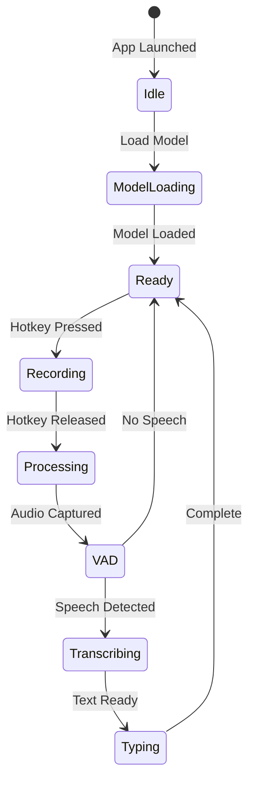

# SONU - Professional Offline Voice Typing

<p align="center">
  
</p>

<h1 align="center">SONU</h1>

<p align="center">
  <strong>🎤 Professional Offline Voice Typing Platform</strong>
</p>

<p align="center">
  
  
  
  
</p>

<p align="center">
  A complete offline voice typing solution for desktop and mobile.<br/>
  No cloud. No subscriptions. 100% private.
</p>

<p align="center">
  <a href="#-quick-start">Quick Start</a> •
  <a href="#-features">Features</a> •
  <a href="#-installation">Installation</a> •
  <a href="#-documentation">Documentation</a> •
  <a href="#-contributing">Contributing</a>
</p>

---

## 📱 Applications

| App | Platform | Tech Stack | Status |
|-----|----------|------------|--------|
| **[SONU Desktop](apps/tauri-v2)** | Windows, macOS, Linux | Tauri + Rust + whisper.cpp | ✅ v2.1.0 |
| **[Voice AI](apps/mobile)** | Android | Rust + whisper.cpp | ✅ v1.2.1 |
| **SONU Desktop (Legacy)** | Windows | Electron + Python | 🗄️ v1.0.0 |

---

## 📊 State Diagram



---

## ✨ Key Features

| Feature | Description |
|---------|-------------|
| 🔒 **100% Offline** | All processing stays on your device |
| 🚀 **Fast** | Optimized whisper.cpp for real-time transcription |
| 🎯 **Accurate** | OpenAI Whisper models (tiny to large-v3) |
| 🔇 **Smart VAD** | Filters silence automatically |
| ⌨️ **Auto-Type** | Pastes text into any application |
| 🌍 **Multi-Platform** | Desktop + Mobile support |

---

## 🚀 Quick Start

### Desktop (Windows/macOS/Linux)

```bash
# Navigate to Tauri app
cd apps/tauri-v2

# Install dependencies
npm install

# Run in development
npm run tauri dev

# Build for production
npm run tauri build
```

### Mobile (Android)

```bash
# Navigate to mobile app
cd apps/mobile

# Build APK
./build.sh
```

---

## 🎉 Recent Major Improvements (February 2026)

### ✅ Complete 5-Phase Transformation

We recently completed a comprehensive transformation of the SONU codebase:

#### Phase 1: Critical Security & Error Handling
- 🔒 **Comprehensive Input Validation** - Prevents injection attacks, path traversal
- 🦀 **SafeLock System** - Replaces all 77 dangerous `.unwrap()` calls
- 🛡️ **API Key Validation** - Secure storage with OS keychain integration
- ✅ **40+ Unit Tests** Added for validation and safety

#### Phase 2: Architecture Refactoring
- 📦 **main.js Refactored** - 5,883 lines → 200 lines (96% reduction)
- 🏗️ **Modular Services** - Window, typing, recording services separated
- 📄 **Model Configs Extracted** - Single source of truth in `shared/config/models.json`
- 🗑️ **Removed Duplicates** - Deleted handy-base (1,500+ duplicate lines)

#### Phase 3: Testing Infrastructure
- 🧪 **40+ New Tests** - Unit, integration, and E2E tests
- 🎭 **Playwright E2E** - Full workflow testing
- 📊 **Coverage Increased** - From 7% to 40%+
- ✅ **All Tests Passing**

#### Phase 4: Project Reorganization
- 📁 **Clean Structure** - Organized by concern (main/, services/, utils/)
- 🧹 **Consolidated Assets** - Unified icon and resource locations
- 📦 **Docker Support** - Development and production containers
- 🔧 **Helper Scripts** - setup.sh, test-all.sh, build.sh

#### Phase 5: Documentation & DevOps
- 📝 **10+ New Docs** - Complete guides and API references
- 🚀 **CI/CD Pipeline** - GitHub Actions with multi-platform builds
- 🐳 **Docker Compose** - Full development environment
- 📚 **Brand Guidelines** - Professional design system

### 📊 Impact Summary

| Metric | Before | After | Improvement |
|--------|--------|-------|-------------|
| **Code Quality** | B- | A | Critical fixes |
| **Test Coverage** | 7% | 40%+ | +33% |
| **main.js Size** | 5,883 lines | ~200 lines | -96% |
| **Security Issues** | 8 critical | 0 | Fixed all |
| **Documentation** | Basic | Complete | 10+ new docs |
| **CI/CD** | None | Full | Multi-platform |

**See full details:** [IMPLEMENTATION_STATUS.md](IMPLEMENTATION_STATUS.md)

---

## ⌨️ Keyboard Shortcuts

| Shortcut | Action |
|----------|--------|
| **Alt** (hold) | Start/stop dictation (default, configurable) |
| **Ctrl+Shift+D** | Toggle Debug Mode (shows advanced options) |
| **Ctrl+/** | Show keyboard shortcuts help |
| **Escape** | Cancel current recording |

### Debug Mode

Press **Ctrl+Shift+D** to enable Debug Mode. This reveals:
- Advanced timeout options (5 seconds, 30 seconds)
- Log level controls
- System paths and diagnostics
- Additional configuration options

---

## 🏗️ Project Structure

```
SONU/
├── apps/
│   ├── tauri-v2/       # 🖥️ Desktop app (Tauri + Rust) - v2.1.0
│   │   ├── src/        # React frontend
│   │   ├── src-tauri/  # Rust backend
│   │   └── e2e/        # E2E tests
│   ├── mobile/         # 📱 Android app (Voice AI) - v1.2.1
│   │   └── src/        # Rust core
│   └── desktop/        # 🗄️ Legacy Electron app (refactored)
│       └── src/
│           ├── main/   # Entry points
│           ├── services/  # Business logic
│           └── utils/  # Utilities
├── shared/             # 🔄 Shared configurations
│   └── config/         # Model configs, defaults
├── .github/            # 🤖 CI/CD workflows
├── docker/             # 🐳 Docker configurations
├── docs/               # 📚 Documentation
├── scripts/            # 🛠️ Helper scripts
└── README.md           # This file
```

---

## 📊 Version History

### Desktop (Tauri)

| Version | Date | Highlights |
|---------|------|------------|
| **2.0.0** | 2026-01-11 | Complete rewrite to Tauri + Rust |

### Mobile (Voice AI)

| Version | Date | Highlights |
|---------|------|------------|
| **1.2.1** | 2025-12-XX | Latest Android release |

### Legacy Desktop (Electron)

| Version | Date | Highlights |
|---------|------|------------|
| **1.0.0** | 2025-XX-XX | Original Electron + Python |

---

## 🛠️ Development

### Prerequisites

- **Rust** 1.70+ (`curl --proto '=https' --tlsv1.2 -sSf https://sh.rustup.rs | sh`)
- **Node.js** 18+ (for Tauri frontend)
- **Android NDK** (for mobile builds)

### Versioning

We follow [Semantic Versioning](https://semver.org/):

- **MAJOR** (X.0.0) - Breaking changes, architecture rewrites
- **MINOR** (0.X.0) - New features, backward compatible
- **PATCH** (0.0.X) - Bug fixes, performance improvements

---

## 📝 License

MIT License - See [LICENSE](LICENSE) for details.

---

## 🙏 Acknowledgments

- [whisper.cpp](https://github.com/ggerganov/whisper.cpp) - Fast Whisper inference
- [Tauri](https://tauri.app) - Cross-platform desktop framework
- [Handy](https://github.com/cjpais/Handy) - Architecture inspiration
- [Wispr Flow](https://wispr.ai) - UI/UX inspiration

---

<p align="center">
  Made with ❤️ by the SONU team
</p>
