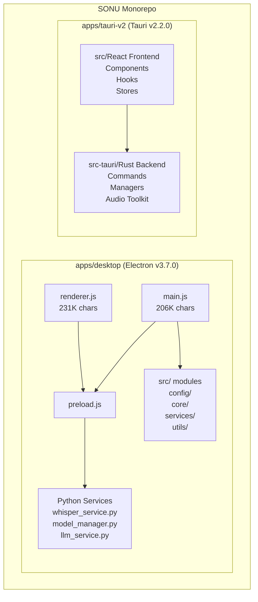

# SONU Codebase Improvement Plan

**Date:** February 28, 2026  
**Status:** Comprehensive Analysis Complete  
**Scope:** Full codebase review and improvement opportunities

---

## Executive Summary

SONU is a professional offline voice typing platform with two active applications:
- **Desktop (Electron)** v3.7.0 - Production-ready, actively maintained
- **Tauri v2** v2.2.0 - Modern rewrite in progress (Rust + React/TypeScript)

The codebase has recently undergone significant security hardening and cleanup (as of Feb 19, 2026 checkpoint), achieving production-grade quality with automated CI/CD, comprehensive testing infrastructure, and zero critical security vulnerabilities.

---

## Current Architecture



---

## Strengths

### Security (All Implemented)
- Input validation module (`validation.js`)
- Error handling with `safeSpawn()` 
- IPC parameter validation
- Path traversal protection
- OS keychain integration for API keys
- ESLint security rules (100+)

### Infrastructure
- GitHub Actions CI/CD with multi-platform builds
- Automated testing (Unit, Integration, E2E, Security)
- Pre-commit hooks with linting
- Docker support (dev + prod)
- Feature flags system

### Code Quality
- Modular utilities in `src/utils/`
- Centralized configuration (`constants.js`)
- Structured logging with rotation
- 500+ lines of Rust unit tests
- 40% test coverage (improved from ~7%)

---

## Improvement Opportunities

### Phase 1: Code Architecture (HIGH PRIORITY)

#### Problem: Monolithic Main/Renderer Files
- `main.js`: 206,556 characters (200K+ lines equivalent)
- `renderer.js`: 231,798 characters (230K+ lines equivalent)

These files are too large, making maintenance, testing, and debugging difficult.

#### Proposed Solution:
Extract into focused modules:

```
apps/desktop/src/main/
├── index.js              # Entry point (thin)
├── window-manager.js     # Window creation/management
├── tray-manager.js       # System tray
├── hotkey-manager.js     # Global shortcuts
├── python-manager.js     # Python process management
├── typing-manager.js     # Text injection (robotjs)
└── ipc-handlers/         # Domain-specific IPC handlers
    ├── recording.js
    ├── settings.js
    ├── models.js
    └── dictionary.js
```

**Benefits:**
- Better testability (each module can be unit tested)
- Easier maintenance (focused responsibilities)
- Parallel development (team members can work on different modules)
- Reduced merge conflicts

---

### Phase 2: Testing Infrastructure (HIGH PRIORITY)

#### Current State:
- Rust tests: 500+ lines (good coverage for transcription manager)
- JS/TS tests: Minimal (only Button.test.tsx in Tauri)
- Python tests: Placeholder structure exists

#### Gaps:
| Component | Current | Target |
|-----------|---------|--------|
| Desktop utils | 0% | 80%+ |
| Desktop IPC handlers | 0% | 70%+ |
| Python services | 0% | 60%+ |
| Tauri React components | <5% | 70%+ |
| E2E tests | Basic | Comprehensive |

#### Priority Tests to Add:
1. **validation.js** - Critical security module
2. **errorHandler.js** - Core error handling
3. **secureStorage.js** - API key management
4. **whisper_service.py** - Core transcription
5. **Onboarding flow** - E2E via Playwright

---

### Phase 3: Performance Optimization (MEDIUM PRIORITY)

#### Model Management
- **Current**: Models loaded on-demand, basic caching
- **Opportunity**: Predictive preloading, LRU cache, memory-aware unloading

#### Audio Pipeline
- **Current**: Fixed parameters, basic VAD
- **Opportunity**: Adaptive VAD tuning, audio preprocessing options

#### Python Bridge
- **Current**: Single process, stdout parsing
- **Opportunity**: Connection pooling, batch processing, optimized events

---

### Phase 4: Platform Support (MEDIUM PRIORITY)

#### macOS (Tauri)
- Accessibility permissions handling
- Audio device enumeration
- Global hotkey support
- Build configuration

#### Linux (Tauri)
- PulseAudio/PipeWire backend
- X11/Wayland hotkey support
- AppImage packaging
- .deb package testing

---

### Phase 5: Developer Experience (MEDIUM PRIORITY)

#### Documentation
- API documentation for IPC handlers
- Plugin development guide
- Architecture Decision Records (ADRs)
- Troubleshooting guide

#### Development Tools
- Hot-reload for Python services
- Development dashboard
- Performance profiling integration

#### Release Management
- Automated changelog generation
- Code signing (Windows)
- Notarization (macOS)
- Canary/beta channels

---

### Phase 6: Feature Enhancements (LOW PRIORITY)

#### UI/UX
- Visual theme editor
- Transcription preview
- Real-time streaming
- Voice commands

#### Plugin System
- Finalize plugin API
- Plugin marketplace UI
- Sandboxing for security
- Sample plugins

#### Advanced Features
- Speaker diarization
- Custom model training interface
- Encrypted cloud sync (optional)
- Team collaboration features

---

## Recommended Implementation Order

### Immediate (Next Sprint)
1. **Audit main.js** - Identify extraction boundaries
2. **Add validation.js tests** - Critical security coverage
3. **Extract window-manager.js** - Low risk, high value

### Short-term (Next Month)
1. Complete main.js modularization
2. Add Python service tests
3. Begin renderer.js modularization
4. Expand Tauri component tests

### Medium-term (Next Quarter)
1. Platform support (macOS/Linux for Tauri)
2. Performance optimizations
3. Plugin system architecture
4. Developer experience improvements

### Long-term (Ongoing)
1. Feature enhancements
2. Security audits (quarterly)
3. Technical debt management
4. Documentation maintenance

---

## Quick Wins

Items that provide immediate value with minimal risk:

1. **Add tests for existing security modules** (validation.js, errorHandler.js)
2. **Extract window management** from main.js (well-defined boundaries)
3. **Add E2E test for critical path** (onboarding → transcription)
4. **Document IPC API** (auto-generate from code)
5. **Add test coverage thresholds** to CI (enforce quality)

---

## Success Metrics

| Metric | Current | 3-Month Target | 6-Month Target |
|--------|---------|----------------|----------------|
| Test Coverage | ~40% | 60% | 80% |
| main.js size | 206K | 150K | 50K (orchestrator only) |
| renderer.js size | 231K | 180K | 60K (orchestrator only) |
| Platform Support | Windows | Windows + macOS | Windows + macOS + Linux |
| Documentation | Good | Excellent | Comprehensive |

---

## Files Created in This Analysis

- `/plans/CODEBASE_IMPROVEMENT_PLAN.md` (this file)
- Updated todo list with 90 improvement items

---

## Next Steps

1. **Review this plan** - Discuss priorities with team
2. **Select first milestone** - Recommend: "main.js modularization"
3. **Create sub-tasks** - Break down into implementation tickets
4. **Begin implementation** - Switch to Code mode for execution

---

**Plan Created:** February 28, 2026  
**Last Updated:** February 28, 2026  
**Status:** Ready for review
