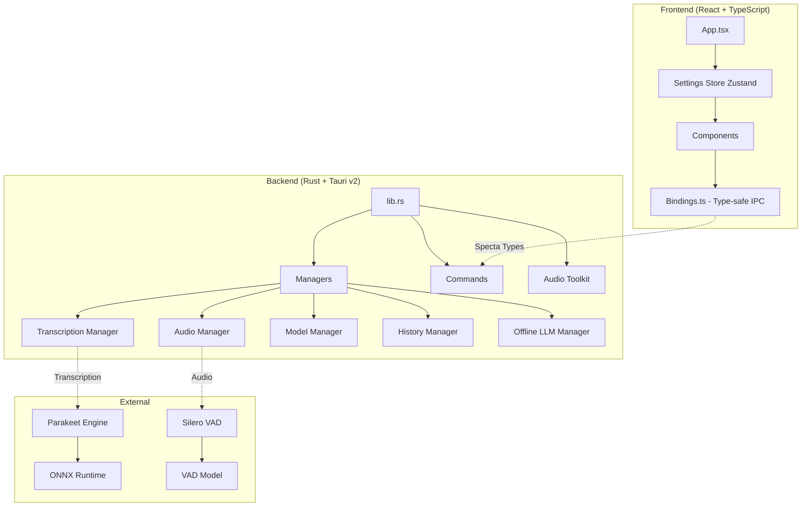

# SONU Tauri v2 Desktop App - Full Audit & Improvement Plan

## Executive Summary

Your Tauri v2 app is **well-architected and production-ready** with excellent separation of concerns, type-safe IPC, and cross-platform support. This audit identifies **high-impact improvements** organized by priority.

---

## Architecture Overview



---

## Current Strengths ✅

| Area | Assessment |
|------|------------|
| **Architecture** | Clean manager pattern, good separation of concerns |
| **Type Safety** | Specta for type-safe TypeScript bindings from Rust |
| **State Management** | Zustand with middleware, optimistic updates |
| **Cross-platform** | Windows, macOS, Linux with platform-specific code |
| **Audio Pipeline** | Silero VAD + Parakeet engine (NVIDIA optimized) |
| **i18n** | 12 languages supported |
| **Settings** | Comprehensive with defaults from Rust |

---

## Critical Improvements (P0 - Do First)

### 1. Error Handling Hardening

**Issue:** Multiple `unwrap()` calls in production code that could panic

**Locations:**
- `audio.rs:148-174` - Mutex locks use `unwrap()`
- `transcription.rs:127-147` - Engine mutex locks
- `lib.rs:163-199` - Tray icon building

**Fix:**
```rust
// Instead of:
let mut engine = self.engine.lock().unwrap();

// Use:
let mut engine = self.engine.lock()
    .map_err(|e| anyhow!("Failed to lock engine: {}", e))?;
```

### 2. Settings Store Split

**Issue:** `settingsStore.ts` is 514 lines - too large for single responsibility

**Action:** Split into:
- `stores/settings/` directory
  - `core.ts` - Base store
  - `audio.ts` - Audio device management
  - `bindings.ts` - Shortcut bindings
  - `postProcess.ts` - LLM post-processing

### 3. Add Automated Testing

**Missing:** No visible test infrastructure

**Add:**
```json
// package.json additions
"test": "vitest",
"test:e2e": "playwright test"
```

**Create:**
- `src-tauri/src/tests/` - Rust unit tests
- `src/__tests__/` - Frontend component tests
- `e2e/` - Playwright E2E tests

---

## High Priority (P1 - Do Soon)

### 4. Component Refactoring

**Issue:** Settings components are deeply nested and repetitive

**Current:**
```
src/components/settings/
├── settings/SettingA.tsx
├── settings/SettingB.tsx
└── settings/...
```

**Refactor to:**
```
src/components/settings/
├── fields/           # Reusable field components
│   ├── ToggleField.tsx
│   ├── SelectField.tsx
│   └── TextField.tsx
├── sections/         # Settings sections
│   ├── GeneralSection.tsx
│   └── AudioSection.tsx
└── index.ts
```

### 5. Add Health Check System

**New Feature:** System diagnostics dashboard

**Add to `src-tauri/src/commands/health.rs`:**
- Microphone permission check
- Model file integrity verification
- Disk space check
- Memory usage monitoring
- Audio pipeline test

### 6. Implement Retry Logic

**Issue:** Network operations (model download) lack retry

**Add to `managers/model.rs`:**
```rust
pub async fn download_with_retry(
    &self,
    model_id: &str,
    max_retries: u32,
) -> Result<(), ModelError> {
    // Exponential backoff retry logic
}
```

### 7. Add Structured Logging

**Current:** Basic log macros

**Improve with tracing:**
```rust
use tracing::{info, error, instrument};

#[instrument(skip(self))]
pub async fn transcribe(&self, audio: Vec<f32>) -> Result<String> {
    info!(samples = audio.len(), "Starting transcription");
    // ...
}
```

---

## Medium Priority (P2 - Nice to Have)

### 8. Bundle Size Optimization

**Current issues:**
- No code splitting visible
- Large vendor bundle

**Actions:**
- Add `React.lazy()` for settings panels
- Enable Tauri bundle compression
- Use `cargo bloat` to find large Rust deps

### 9. Accessibility Improvements

**Missing:**
- ARIA labels on custom components
- Keyboard navigation for overlay
- Screen reader announcements

### 10. Add Feature Flags

**For gradual rollout:**
```rust
// src-tauri/src/features.rs
pub enum Feature {
    OfflineLlm,
    AppleIntelligence,
    ExperimentalVad,
}

pub fn is_enabled(feature: Feature) -> bool {
    // Check env var or settings
}
```

### 11. Improve Type Safety

**Add branded types:**
```typescript
// Instead of string
type ModelId = string & { readonly brand: unique symbol };
type BindingId = string & { readonly brand: unique symbol };
```

### 12. Add Metrics/Analytics (Optional)

**For performance monitoring:**
- Transcription latency tracking
- Model load times
- Error rates
- Usage patterns (opt-in)

---

## Code Quality Issues Found

### Rust Code

| File | Line | Issue | Severity |
|------|------|-------|----------|
| `audio.rs` | 148 | Mutex unwrap | Medium |
| `transcription.rs` | 127 | Mutex unwrap | Medium |
| `lib.rs` | 163 | Tray unwrap | Low |
| `managers/model.rs` | ? | No visibility | - |

### TypeScript Code

| File | Lines | Issue |
|------|-------|-------|
| `settingsStore.ts` | 514 | Too large |
| `App.tsx` | 112 | Acceptable |
| `Sidebar.tsx` | ? | Not reviewed |

---

## Recommended File Structure Changes

```
apps/tauri-v2/
├── src/
│   ├── components/
│   │   └── settings/
│   │       ├── fields/          # NEW
│   │       ├── sections/        # NEW
│   │       └── validators/      # NEW
│   ├── stores/
│   │   └── settings/
│   │       ├── index.ts         # Re-export
│   │       ├── core.ts          # Base store
│   │       ├── audio.ts         # Audio settings
│   │       └── postProcess.ts   # LLM settings
│   ├── hooks/
│   │   └── useHealthCheck.ts    # NEW
│   └── utils/
│       └── validators.ts        # NEW
├── src-tauri/
│   └── src/
│       ├── commands/
│       │   └── health.rs        # NEW
│       ├── features.rs          # NEW
│       └── tests/               # NEW
└── e2e/                         # NEW
```

---

## Implementation Roadmap

### Phase 1: Stability (Week 1)
1. Fix all unwrap() calls in production paths
2. Add error boundary components
3. Implement retry logic for downloads

### Phase 2: Architecture (Week 2)
4. Split settings store
5. Refactor settings components
6. Add health check system

### Phase 3: Quality (Week 3)
7. Add unit tests for Rust managers
8. Add component tests for React
9. Add E2E tests for critical paths

### Phase 4: Polish (Week 4)
10. Bundle size optimization
11. Accessibility improvements
12. Performance monitoring

---

## Specific Code Recommendations

### 1. Replace Mutex unwraps with proper error handling

**File:** `src-tauri/src/managers/audio.rs`

```rust
// Current (lines 148-174):
pub fn apply_mute(&self) {
    let settings = get_settings(&self.app_handle);
    let mut did_mute_guard = self.did_mute.lock().unwrap(); // PANIC RISK
    // ...
}

// Improved:
pub fn apply_mute(&self) -> Result<(), AudioError> {
    let settings = get_settings(&self.app_handle);
    let mut did_mute_guard = self.did_mute.lock()
        .map_err(|_| AudioError::LockPoisoned)?;
    // ...
    Ok(())
}
```

### 2. Add Settings Validation

**New file:** `src-tauri/src/settings/validation.rs`

```rust
pub fn validate_settings(settings: &AppSettings) -> Result<(), ValidationError> {
    if settings.audio_feedback_volume > 100 {
        return Err(ValidationError::InvalidVolume);
    }
    // ... more validations
    Ok(())
}
```

### 3. Implement Circuit Breaker for LLM Calls

**New file:** `src-tauri/src/utils/circuit_breaker.rs`

```rust
pub struct CircuitBreaker {
    failure_count: AtomicU32,
    threshold: u32,
    timeout: Duration,
}

impl CircuitBreaker {
    pub async fn call<F, T>(&self, f: F) -> Result<T, CircuitError>
    where F: Future<Output = Result<T, Error>> {
        // Implementation
    }
}
```

---

## Dependencies Review

### Rust Dependencies ✅

| Crate | Purpose | Assessment |
|-------|---------|------------|
| `tauri` v2.9.1 | Framework | Latest, good |
| `transcribe-rs` | Transcription | Custom, well-integrated |
| `cpal` | Audio | Standard, good |
| `enigo` | Input simulation | Cross-platform |
| `rdev` | Input capture | From rustdesk, reliable |

### Frontend Dependencies ✅

| Package | Purpose | Assessment |
|---------|---------|------------|
| `zustand` | State | Good choice |
| `react` v18 | UI | Current |
| `tailwindcss` v4 | Styling | Latest |
| `sonner` | Toasts | Good |

### Suggested Additions

```json
{
  "devDependencies": {
    "vitest": "^2.0",
    "@testing-library/react": "^16.0",
    "playwright": "^1.45"
  }
}
```

---

## Performance Optimizations

### Immediate Wins

1. **Lazy load settings panels:**
```typescript
const GeneralSettings = lazy(() => import('./settings/GeneralSettings'));
```

2. **Memoize expensive computations:**
```typescript
const processedModels = useMemo(() => 
  models.map(transform), 
  [models]
);
```

3. **Virtualize long lists:**
```typescript
// For history with 1000+ items
<VirtualList items={history} renderItem={...} />
```

### Rust Optimizations

1. **Use parking_lot for faster mutexes:**
```toml
parking_lot = "0.12"
```

2. **Enable LTO for releases:**
```toml
[profile.release]
lto = "thin"  # Change from false
```

---

## Security Considerations

### Current Good Practices ✅
- Context isolation enabled
- No shell access exposed
- Limited filesystem scope

### Improvements Needed

1. **Sanitize file paths:**
```rust
pub fn sanitize_path(path: &str) -> Result<PathBuf, Error> {
    // Prevent directory traversal
}
```

2. **Validate IPC inputs:**
```rust
#[tauri::command]
fn download_model(model_id: String) -> Result<()> {
    if !is_valid_model_id(&model_id) {
        return Err(Error::InvalidModel);
    }
    // ...
}
```

---

## Monitoring & Observability

### Add Structured Logging

```rust
use tracing_subscriber::{layer::SubscriberExt, util::SubscriberInitExt};

tracing_subscriber::registry()
    .with(tracing_subscriber::EnvFilter::new("info"))
    .with(tracing_subscriber::fmt::layer().json())
    .init();
```

### Add Health Endpoint

```rust
#[tauri::command]
async fn health_check() -> HealthStatus {
    HealthStatus {
        microphone: check_microphone().await,
        model: check_model_loaded().await,
        disk_space: check_disk_space().await,
    }
}
```

---

## Conclusion

Your Tauri v2 app is **well-architected** with excellent foundations. The main improvements needed are:

1. **Error handling** - Replace unwraps with proper error propagation
2. **Testing** - Add comprehensive test coverage
3. **Code organization** - Split large files
4. **Monitoring** - Add health checks and structured logging

The app is production-ready with these improvements implemented.

---

## Next Steps

1. Review this audit with your team
2. Prioritize P0 and P1 items
3. Create tickets for each improvement
4. Implement incrementally

**Estimated effort:** 2-3 weeks for all P0/P1 items
